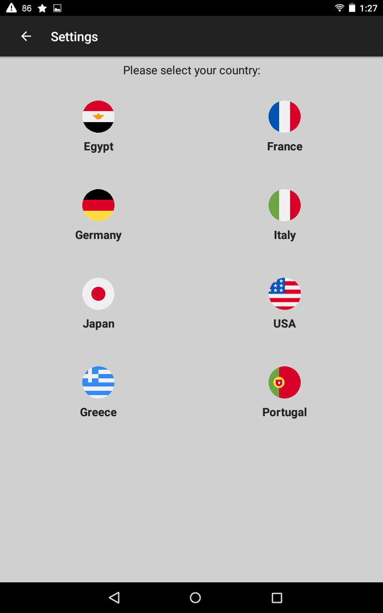
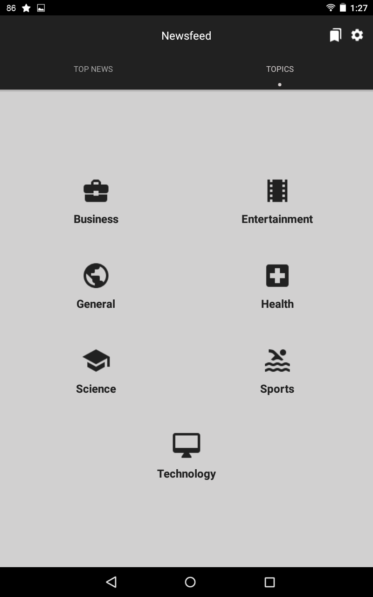

# News Reader Android APP
Android App that gathers different news from over 50 sources across different 9 countries around the world.
Contains news from 7 topics ex:Health,Technology,Sports etc...
 
 

## Features:
* Browse News By Topics ex: Sports,Health etc...
* Browse News By Countries.
* Gathers News from over 50 different news sources around the world.
 
 

## Screenshots:

 
 

## Technologies & Libraries Used:
* Retrofit
* Glide
* [NewsAPi.org](https://newsapi.org)
* [Android View Animations](https://github.com/daimajia/AndroidViewAnimations)
* [Navigation Tap Strip](https://github.com/Devlight/NavigationTabStrip/tree/master/app/src/main)
 
 

## To Do:
* Add Search bar to search for specific keywords.
* Add Bookmarks using ORM technique and implementing it by Room persistence library.
